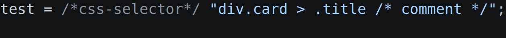
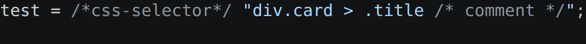

# Inline CSS Selector Comments

Highlight `/* ... */` comments inside CSS selector string literals in JS/TS.

## Usage

Put the marker directly in front of the string:

```js
const a = /* css selector */ ".my-class /* class selector */";
const b = /* css selector */ "#app > .title /* ID and child combinator */";
const c = /* css selector */ "input[type='text'] /* attribute selector */";
const d = /* css-selector */ '.single';
const e = /* css selector */ `.tpl .child`;
```

The selector keeps your theme's normal string color; inner `/* ... */` blocks are highlighted as comments.

## Before / after

`test = /*css-selector*/ "div.card > .title /* comment */";`

| Before | After |
| --- | --- |
|  |  |

The inner `/* comment */` now renders in the comment color instead of blending into the string.

## Markers

`/* css selector */` and `/* css-selector */`, both supported.

## Languages

JavaScript / TypeScript (incl. JSX, TSX), and the `<script>` block of Vue / Svelte / Astro.

## Notes

- The marker must be a block comment directly in front of the string.
- Strings without the marker are untouched.
- Escaped quotes (`\"`) won't terminate the string early.

## License

[MIT](LICENSE)
